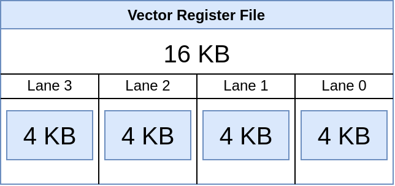
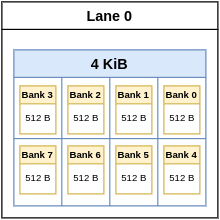
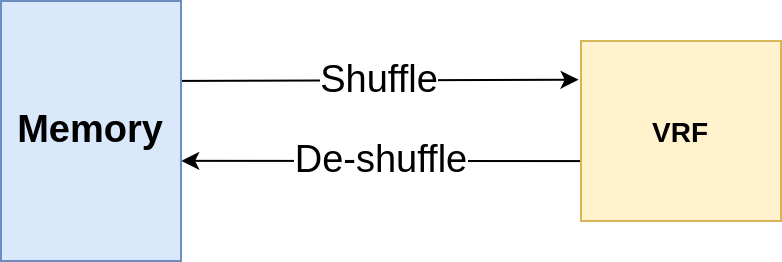
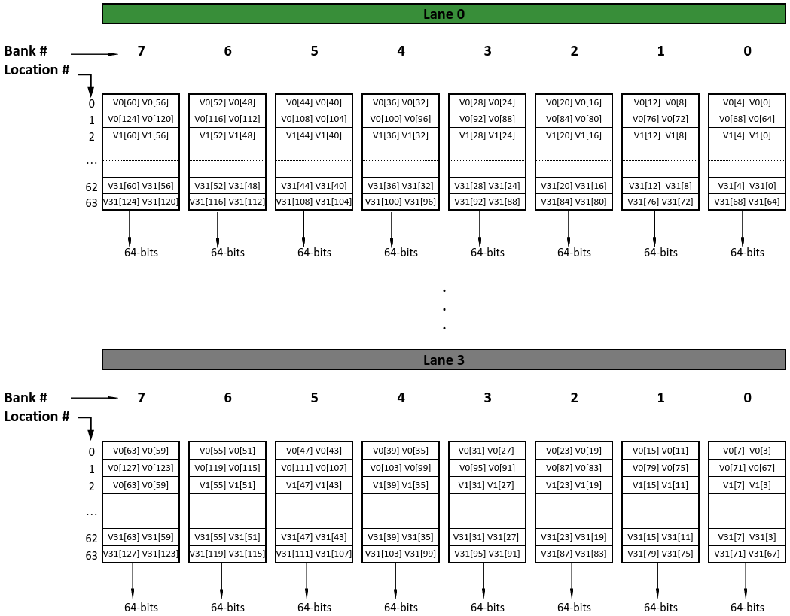
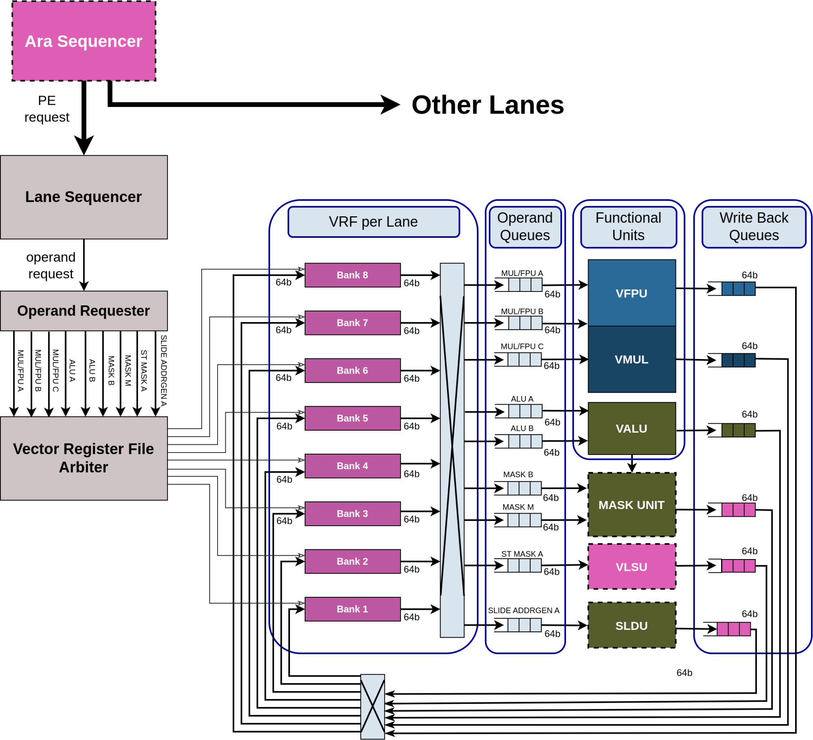

# `vrf` — Ara's Vector Register File (VRF)

## Ara Vector Register File

The Vector Register File (VRF) of Ara is implemented using a set of single ported (1RW) memory banks. The width of each bank is 64-bits which is the same as the width of the datapath of each lane. There are eight banks per lane resulting in eight single ported memory banks per lane. In the RVV ISA there are 32 vector registers. The size of each vector register, in bits, is implementation dependent (minimum = 128 bit).  Let's look at the size of VRF by using an example.

Size of Vector register  (VLEN) = 4096 bit

Size of Vector Register File = 4096 * 32 = 217 bits = 16 KiB

Number of Lanes in Ara can vary from 1 to 16 (implementation dependent). So for a 4 lane system the VRF will be divided into 4 lanes with 4KiB of memory per lane.

Benefits of splitting VRF across lanes:

* As lanes are our processing elements so most computation constrained within one lane makes hardware implementation easy.

* Removes the dependency of the execution units  on the number of lanes which makes Ara scalable.

* As VRF is internal to the lane routing between VRF and lane execution logic is simplified.

### Division of VRF into Banks

As indicated earlier the portion of VRF inside a lane is further divided into eight 64-bit wide banks. Each bank is implemented using a single-ported SRAM memory. Being a single ported memory it has only one address port for both reads and writes. In steady state, under worst case conditions, 5 banks are accessed simultaneously in order to support predicated multiply-accumulate instructions (which require 3 source registers plus the mask register resulting in 4 reads, and one destination register -resulting in a single write). This is the worst case for a single instruction. But more instructions can be executed at the same time in different units (e.g. vload + vslide + vmacc.m) and they can access up to 8 banks per lane at the same time all together.

Continuing with the earlier example, where each of the four lanes has 4KiB of memory, each lane will as such have 8 banks of 512B (4096B / 8 =  512B) memory. Given that each bank is 64-bits wide there will be 64 (512B/8B = 64) 8B wide addressable locations within each bank.

Since each lane has  4KiB of VRF memory the address bus, going to each lane,  will be 12-bits wide. Since there are 8 banks within a lane the least significant 3 bits of the address are used for addressing the 8 banks and the remaining 9-bits are used to address the byte within the bank. Of these remaining 9-bits, 6-bits are used to address 1-of-the-64 64-bit locations within the bank and the remaining 3 bits of the address are used to address the individual byte within the 64-bits.

### Translating Vector Register Number to SRAM memory Bank

Vector register number fields ranging in value from 0 to 31 (5-bits) are present in the instruction. They are decoded and used to determine the starting address of that vector register in the VRF memory. Within a lane the vector registers are stored as a contiguous set of bytes. The register number (vid) is multiplied by a factor which is equal to the number of bytes in a single vector register divided by the number of lanes. The resulting number gives the starting address of the vector register in the VRF memory.

For normal cases the starting address of every vector register is a multiple of 8 given that the multiplying factor that is used is a  power of 2 and  greater than or equal to 8. For our continuing example this factor is equal to 128 [(4096/8)/4].  In some cases where VLEN is small e.g.128, and number of lanes are high e.g. 16 this is not true.  So if the address is a multiple of 8  then the least significant three bits of the address are always 0.  As indicated earlier the least significant 3 bits of the address are used to select the bank. As such every vector register has its first element (its starting point) in the first bank i.e., bank 0 and this will cause bank conflicts which are discussed later.

Continuing with our example the following table gives the starting address in the VRF memory for all 32 vector registers. As can be seen the last nibble of every address is 0 implying that the last 3 address bits are always 0 and as such always pointing to bank 0.

.. csv-table:: Starting Address of 32 Vector Register in VRF Memory
   :file: /documents/Vector_Starting_Addr.csv
   :header-rows: 1

This arrangement causes bank conflicts because banks are composed of single ported memories and as such only a single request to read or write an operand can be sent to a bank. However functional units can request multiple operands simultaneously and as such need to access the same bank at the same time causing bank conflicts.

To resolve bank conflicts Ara uses a weighted round robin priority arbiter per bank. Mask register (v0) has the highest priority, followed by reading of operands A, B, C, and then writing a destination register.

### Organization of Elements in Vector Register File

Elements of a  vector register are mapped to consecutive lanes in the VRF. Each lane’s  datapath width is 64 bits which matches the width of an individual register file bank. The  figure below shows 4 lanes, numbered 0-3  with each lane having 8 bytes (64 bits) and the consecutive bytes numbered 0 - 1F. Since there are functional units present in each lane, groups of elements can be processed in parallel. For example if we have four 64-bit elements and four lanes then each element is placed in a different lane shown by the numbers 0-3 below. All 4 of these elements can be accessed simultaneously from the VRF and can be operated upon in parallel.

Continuing with the previous arrangement across lanes, elements within a single lane are also arranged in an order such that when the element width changes the mapping between some of the elements and lanes remains the same. Due to this, the mapping between consecutive bytes in a lane and consecutive bytes of an element is not the same. This is resolved by using shuffle logic described in the next section.

As an example with a vector length of 256B (2048-bits) and 4 lanes each of which are  64-bits wide the mapping of bytes for various sizes of SEW are shown below:

For the first case (SEW = 64) the arrangement is simple and obvious. Each 64-bit element is mapped into a different lane and the bytes of each element are contiguously stored within the lane. For the second case (SEW = 32) elements 0, 1, 2 and 3 are mapped in the lower half (32-bit) of lane 0 through lane 3. Element 4 then gets mapped to the upper half of lane 0 and so on until element 7 gets mapped to the upper half of lane 3. It is important to note that the least significant byte of  elements 0, 1, 2 and 3 for both cases of SEW are mapped to the same byte location within the corresponding lanes.  This process continues to be repeated for the remaining values of SEW.

In the case of SEW = 16 and 8 there is an additional thing to observe. When we start from lane 0 to start assigning the first byte of a new element we also observe which half of the lane (upper or lower 32-bits) the last element in the lane was assigned.  For the new assignment we pick the half which was not used the previous time. So in the case of SEW = 16  when it comes time to assigning element 8 it is placed in Lane 0’s byte position 2 (lower half of lane 0) and not byte position 6 (upper half of lane 0)  since the last element assigned in lane 0, element 4, was assigned in byte position 4 (upper half of lane 0).

The above arrangement of elements and their corresponding bytes in the VRF is constrained within the lane. Data outside the lane i.e in memory, is arranged with bytes packed simply from the least-significant byte to the most-significant byte in increasing memory addresses. As such when data is moved between the memory and the VRF bytes get shuffled/de-shuffled to match the appropriate required ordering. These two ordering of elements and bytes is referred to as Lane Organization of bytes and Natural Packing of bytes.

**Lane Organization:** The manner in which elements and their corresponding bytes are stored in the VRF as discussed above.

**Natural Packing:** The elements and bytes packed in memory with the least-significant bye to the most-significant byte in increasing memory addresses.

### Shuffle Logic

As shown in the figure below the shuffle/de-shuffle logic sits between the memory subsystem and the VRF. When data is moved from memory to the VRF (via a load instruction) it gets shuffled from the Natural Packing arrangement to the Lane Organization arrangement. Similarly When data is moved from VRF to memory (via a store instruction) it gets de-shuffled from the  Lane Organization to the Natural Packing arrangement.

The mapping of bytes from Natural Packing to Lane Organization for 4 lanes and SEW of 16 is shown in the figure below.  For element 0, byte indices are the same, 0 & 1, for Natural Packing and Lane Organization. Element 1 is mapped  to byte index 8 in the VRF with its two bytes in indices 8 & 9 in the VRF. Shuffle logic takes the sequential bytes from memory as shown in the natural Packing row and converts it into the Lane Organization arrangement as shown in the Lane Organization row. De-shuffle logic does the opposite.

The arrangement of the shuffle/de-shuffle logic is a function of the vector’s SEW. This means that when a vector is moved from Memory to the VRF bytes get shuffled based on the value of the vector’s SEW. Similarly when a vector is moved from the VRF to memory bytes get reshuffled based on the vector’s SEW. As such in addition to the bytes of a vector being stored in the VRF it also gets tagged, in hardware, with its SEW. This tag is subsequently used by the de-shuffle logic when data is moved back to memory.

The following figure shows how bytes are stored in memory (Natural Packing) and how they get stored in the VRF (Lane Organization.) Thirty two bytes named A0 to H3 are stored sequentially in memory locations 0 through 31 (natural ordering)  as shown in the Memory image below. Subsequently these 32 bytes are stored in the VRF using different SEW values as shown in the VRF image below.

For example Lane 1’s byte location 11 can have memory bytes C3, B3, E3 or G1 for SEW values 64, 32, 16 and 8 respectively . So the shuffle multiplexor for this byte is as follows:

Lane 1 [ location 11]  =  (SEW = = 64) ? C3 : ((SEW == 32) ? B3 : ((SEW == 16) ? E3 : G1))

Similarly the deshuffle multiplexor for memory location 11 is as follows:

Memory [location 11] =   (SEW = = 64) ? Lane 1[location 11)] :  ((SEW == 32) ? Lane 2[location 19] : ((SEW == 16) ? Lane 1[location 13] : Lane 3[location 25]))

These byte multiplexores get replicated in both directions for every byte coming from memory into the VRF and every byte going out from the VRF to memory.

### Reshuffle Logic

In a multi-lane architecture with the VRF distributed across multiple lanes, certain peculiar issues arise for instructions which cross lane boundaries (e.g., the narrowing and widening instruction). These issues get further exacerbated because of the architectural requirement of supporting the tail-undisturbed policy i.e., the requirement that elements past the vector length should not be modified. When an instruction writes to a vector register, vd, that was originally encoded with a EEW different than the new EEW and the old contents of vd are not fully overwritten then the old contents of vd get corrupted and the tail undisturbed policy gets violated. To avoid this corruption of the tail elements the slide unit, which has access to all the lanes, performs a shuffling operation on the vector register. This shuffling operation is called reshuffle.

Let us take the example of a simple vector unit with a 256bit (32B) wide vector register and four lanes with each lane being 64bit (8B) wide. Each lane has a single 256B SRAM bank configured as 32x64bit wide 1R1W port memory. As such each bank implements a ¼ of the VRF. The examples below are limited to SEW values of 16 and 32.

Mapping of vector elements, in the SRAM, based on Natural Packing is shown below:

Mapping of vector elements, in the SRAM, based on Lane Organization is shown below:

Each lane has 8 bytes of the vector and the vector elements are mapped starting from Lane 0 all the way to Lane 3.
For Natural Packing & SEW = 32 Lane 0 contains elements 0 and 1, Lane 1 contains elements 2 and 3, Lane 2 contains elements 4 and 5 and Lane 3 contains elements 6 and 7. Similarly the mappings of the 16 elements for SEW = 16 are also shown. As such consecutive elements of the vector register are stored in consecutive lanes.
For Lane Organization & SEW = 32 Lane 0 contains elements 0 and 4, Lane 1 contains elements 1 and 5, Lane 2 contains elements 2 and 6 and Lane 3 contains elements 3 and 7. Similarly the mappings of the 16 elements for SEW = 16 are also shown. Here consecutive elements are stored in different lanes.
The following memory image is used in the examples below. Consecutive vector bytes are stored in consecutive locations in memory.

Bytes are numbered from A0 through Q”3 with A0 stored in memory location 0 and Q”3 stored in memory location 191.
In the case of Natural Packing data movement between memory and the VRF is fairly straight forward and there is a one to one mapping between the memory image and the VRF image of individual bytes. In case of Lane organization, as discussed above,  the mapping is not straight forward and requires a shuffle/deshuffle unit between the memory and the VRF to get the data bytes in the correct position.

#### Natural Packing

Let us take an example of a Narrowing instruction with source SEW = 32 and LMUL = 2 and a destination EEW = 16 and the corresponding EMUL = 1. Taking the case of Natural Packing we look at the case with the destination register initially having a SEW of 32. Below the source registers are identified as Vs and Vs+1. The destination register before the instruction is executed is identified as Vd’:

Since the source SEW = 32 there are 8 elements in each source register for a total of 16 elements and 64 bytes. These 64 bytes A0 – Q3 are loaded from memory locations 0 to 63 into the source registers.

The vector length, vl, for the narrowing instruction is set to 11. This means that only the first 11 elements of the destination register, Vd, should be modified and the remaining 5 elements of the destination register are part of the tail and should not be disturbed. Taking the Vector Narrowing Integer Right Shift Instruction as an example:

Narrowing Instruction (source 4 bytes, shift amount = 0) -> Destination 2 bytes

e.g., for the first source element A3A2A1A0:

Narrowing Instruction (A3A2A1A0, 0) -> A”1A”0

with A”0 being the least significant byte and A”1 being the most significant byte of the resulting 16bit result. Note the bytes are identified with a (“) but they are the source’s least significant bytes A0 and A1.

Vd” shows the content of Vd’ after the instruction is executed:

Result bytes move across lanes, requiring the use of the Slide unit. The destination bytes (from Vd’) that should remain unchanged get preserved and transferred to Vd” as shown above in a straightforward manner.

The case with Vd’ having a SEW of 16 before the execution of the instruction is shown below:

Once again destination bytes that should be unchanged (from F’2 to H’3) get preserved and transferred to Vd”. Hence if bytes are mapped in the VRF according to Natural Packing order the tail undisturbed policy gets implemented without requiring any special logic.

#### Lane Organiation

Now let’s look at the case of Lane Organization of the VRF. The source registers and the destination register (before instruction execution) are shown below. This is the case where initially the destination register has a vector with SEW = 32 stored in it. As can seen in this organization consecutive bytes from memory are not stored in consecutive lanes because the elements are not stored in consecutive lanes.

After the Vector Narrowing Integer Right Shift Instruction is executed Vd changes as shown below from Vd’ to Vd”:

The last 5 tail elements are unchanged between Vd’ and Vd”. However because these elements are not stored in consecutive locations they are now distributed across all four lanes. Now de-shuffling these (using the de-shuffle multiplexor discussed earlier) so that it can be written to memory in the correct order we get:

Comparing this with Natural ordering we see that two of the tail elements are totally incorrect and two are in the wrong position (only one element is correct and in the correct position.) These discrepancies can be resolved by shuffling the contents of the destination register before the instruction is executed and ordering the elements of the destination in line with the new destination EEW. This step is called reshuffle and is shown in the figure below. For ease of understanding this reshuffle process is shown as a two-step process below.

    Step 1: the destination is de-shuffled  into natural ordering based on its existing EEW

    Step 2: the result of step 1 is shuffled  into lane organization based on the new EEW.

Now using this new reshuffled Vd’ and executing the narrowing instruction we get:

Now de-shuffling these so that it can be written to memory in the correct order we get:

Comparing this with Natural Ordering we see that the correct tail elements are preserved in the correct locations. Hence by reshuffling the destination register so that it’s SEW matches the EEW of the instruction’s destination register EEW we can correctly implement the tail undisturbed policy.  As is obvious from the figure above if the SEW & EEW match then reshuffling is not required.

### Mapping of Vector Elements to the Memory Banks

Continuing on let's look at the mapping between the elements of an individual vector register and the VRF memory banks. As an example with VLEN=4096, SEW=64 and 4 lanes, we have a total 64 elements which are numbered from 0 to 63. In Natural packing vector representation V0 is shown below with Vn[x] indicating the xth 64-bit element of the vector register Vn:

In the VRF the individual vector registers and their corresponding elements are distributed across 4 lanes. Continuing with our example elements of vector register V0 are distributed across lanes and memory banks as shown below:

For 4 lanes a 4096-bit (512B) vector requires 64 memory banks with each bank being 64-bits wide. Since there are 4 lanes with each lane having 8 banks there are a total of 32 banks in a single “row” location. Hence two memory row locations are needed for the full vector. This can be seen in the figure above, for SEW = 64, where memory row locations 0 and 1 are occupied  by V0, locations 2 & 3 are occupied by V1 all the way to locations 62 & 63 being occupied by V31.

Taking another example for the same vector size of 4096-bit but with a SEW = 32 we have a total 128 elements which are numbered from 0 to 127. In Natural packing vector representation V0 is shown below:

Once again, as discussed above, each vector register occupies two rows of memory banks. Since the element width is 32-bits and the bank width is 64-bits each bank contains two elements. This is shown in the figure below:

### Vector Register File and Operand-Delivery Interconnect

Each lane of the vector processor has 3 functional units:

1.  Vector Floating-point Unit (VFPU)
2.  Vector Multiplier (VMUL)
3.  Vector Integer ALU (VALU)

A Vector Load & Store unit (VLSU) for Lector Load and Store instructions and a Slide unit (SLDU) for Vector Slide instructions are present as separate units outside the lanes.

The datapath of each functional unit matches the VRF memory bank width of 64-bits.

The lanes receive requests from the main Ara sequencer to execute vector instructions. The request contains the following information about the vector instruction:

- Vector and scalar source operand register numbers
- Mask register number
- Vector & scalar destination register numbers
- Effective length multiplier
- Value of the vector length
- Value of the vector start
- Vector type (values from the vtype CSR register)
- etc.

Every lane has its own sequencer (Lane Sequencer) that receives the requests and interfaces with the Operand Requester and the functional units.

The Operand Requester along with the Vector Register File Arbiter requests individual operand elements from the VRF banks. The target functional unit information etc., is also passed along with the request. The fetched operands from the VRF, for the functional units, are then passed to the Operand Queues. As discussed earlier the multi-banked organization of the VRF leads to banking conflicts when several functional units try to access operands in the same bank. Each lane is provided with a set of operand queues between the VRF and the functional units to absorb delays due to such banking conflicts. Similarly writing results back into the VRF can also cause bank conflicts. Write Back  queues present at the output of each functional unit are provided to absorb any delays due to banking conflicts. All the queues are 64-bits wide.

There are nine Operand Queues connecting the VRF banks to the functional units:

- Three are dedicated to the VFPU/VMUL.
- Two are dedicated to the VALU.
- Two are dedicated to the Mask Unit.
- One is dedicated to the VLSU.
- One is dedicated to the SLDU.

Operand Queues send their operands to the functional units as the operands become available and the functional unit is ready for the next operation.

There are six Write Back Queues one from each of the Functional units. Each Functional unit has a Write Back queue inside the unit.

